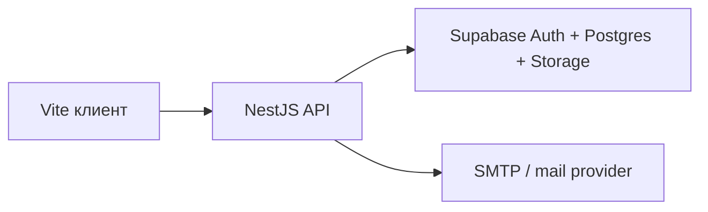
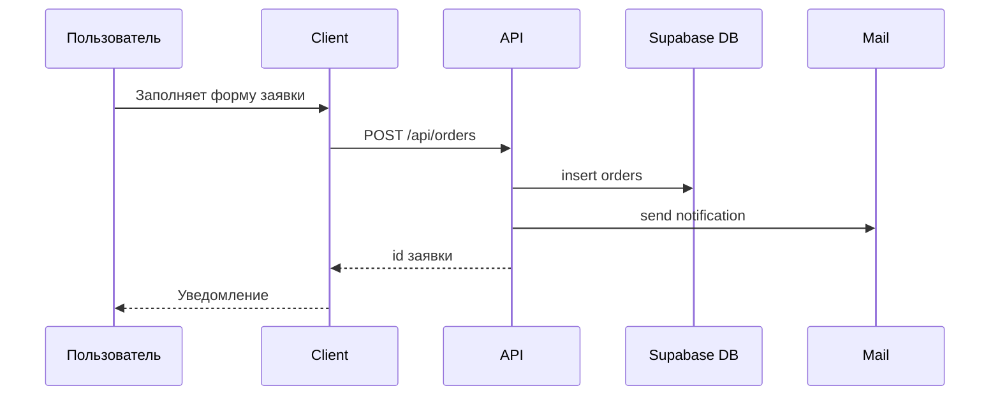
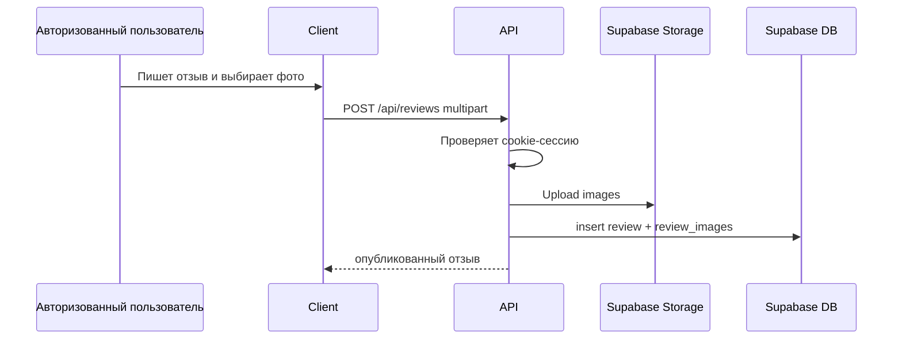
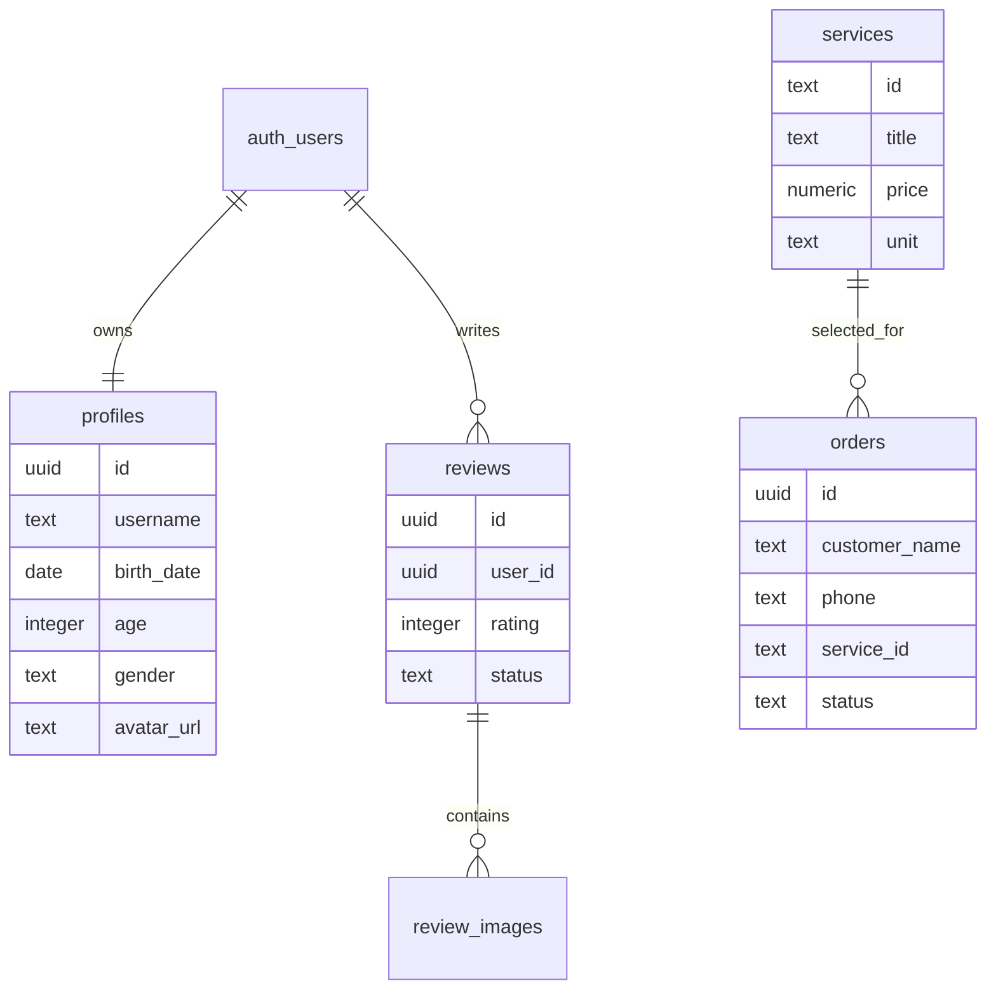

# Архитектура

Проект разделен на три слоя:

## Frontend

`client/` — легкий Vite + TypeScript клиент без React. Он отвечает только за отображение, формы и UX-состояние. В браузере больше нет Supabase key, EmailJS key и паролей в `localStorage`.

Клиент получает данные через `/api`:

- услуги;
- сотрудников;
- отзывы;
- профиль;
- расчет стоимости;
- создание заявок и отзывов.

## Backend

`server/` — NestJS REST API.

Основные модули:

- `auth` — регистрация, вход, выход, `me`, HttpOnly cookies;
- `profiles` — профиль пользователя;
- `services` — каталог услуг и цены;
- `employees` — сотрудники;
- `orders` — заявки клиентов и email-уведомление;
- `reviews` — отзывы;
- `uploads` — загрузка изображений в Supabase Storage;
- `calculator` — расчет стоимости по серверным ценам.

## Data Flow

Заявка:

Отзыв:

## ER Overview

